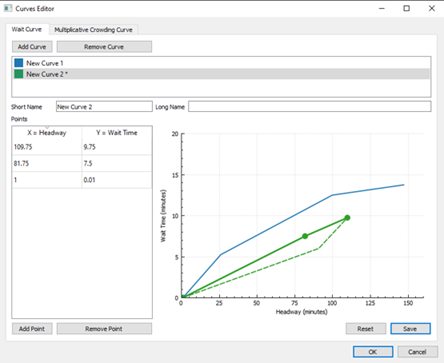

# headway-editor
Example GUI for editing wait curves used for transportation modelling. Built using Qt5 and C++. This was my first GUI created using Qt Framework.

Double click to add points to the graph. Changes are shown as solid color lines, last saved values are shown as dotted lines. Selecting points on the graph highlights their values in the table. Points can be dragged to new locations, so long as they are within range. Drags outside of range will not move the point beyond their last legal position.

New curves are automatically assigned a color. Colors correspond to those shown in the list (top).

The graph subclasses QCustomPlot. Changes appear in the table in real time. Both the graph and the table manipulate the same model.

